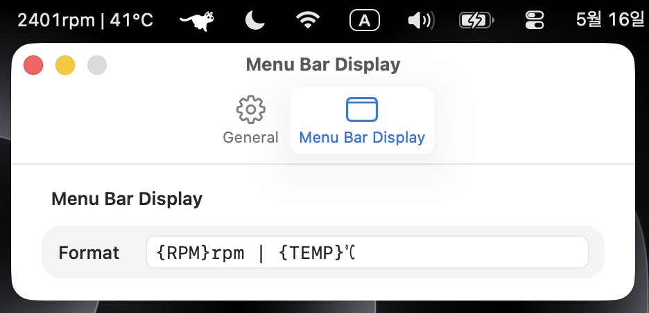

# mFanCtl

mFanCtl is a macOS menu bar fan control utility for Apple Silicon Macs with
built-in fans. The temperature shown in the menu bar is based on GPU
temperature.

## Requirements

- Apple Silicon Mac with built-in fans
- macOS 14 or later
- macOS approval is required to enable the fan control helper

Fanless models such as MacBook Air cannot use fan control. Intel Macs are not
supported.

## Features

- Show fan RPM and GPU temperature in the menu bar
- Read Apple Silicon fan speed and temperature sensors
- Switch fan mode between Automatic and Maximum Speed
- Create custom fan presets
- Customize the menu bar display format
- Optional launch at login

## Installation

Download the latest DMG from the Releases page, open it, and drag `mFanCtl.app`
to Applications.

When fan control is enabled, macOS may ask you to allow the fan control helper.

## Notes

mFanCtl uses undocumented Apple SMC interfaces. Sensor availability and fan
behavior may vary by Mac model and macOS version.

Use fan control carefully. If something behaves unexpectedly, switch back to
Automatic mode or restart your Mac.

## License

MIT
